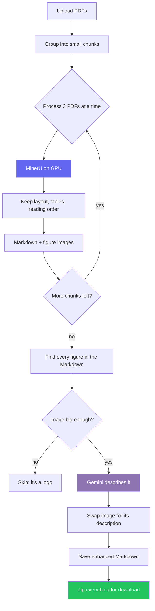

<div align="center">

# PDF to MD Converter

**Turn a folder of research papers into clean, LLM-ready Markdown — figures described in words, tables kept intact, all running on a free Google Colab GPU.**

[](https://github.com/ajith2189/PDF_to_MD_Converter/stargazers)
[](https://github.com/ajith2189/PDF_to_MD_Converter/network/members)
[](LICENSE)
[](https://colab.research.google.com/github/ajith2189/PDF_to_MD_Converter/blob/main/PDF_to_MD_Converter.ipynb)

[](https://www.python.org/)
[](https://github.com/opendatalab/MinerU)
[](https://ai.google.dev/)
[](https://developer.nvidia.com/cuda-toolkit)
[](CONTRIBUTING.md)

</div>

---

## Table of Contents

- [About](#about)
- [Why This Project](#why-this-project)
- [Features](#features)
- [What You Need Before Starting](#what-you-need-before-starting)
- [Step 1 — Get Your Free Gemini API Key](#step-1--get-your-free-gemini-api-key)
- [Step 2 — Open the Notebook in Colab](#step-2--open-the-notebook-in-colab)
- [Step 3 — Turn On the Free GPU](#step-3--turn-on-the-free-gpu)
- [Step 4 — Add Your API Key to Colab](#step-4--add-your-api-key-to-colab)
- [Step 5 — Run the Setup Cells](#step-5--run-the-setup-cells)
- [Step 6 — Upload Your PDFs](#step-6--upload-your-pdfs)
- [Step 7 — Convert](#step-7--convert)
- [Step 8 — Let the Figures Be Described](#step-8--let-the-figures-be-described)
- [Step 9 — Download Your Markdown](#step-9--download-your-markdown)
- [The Whole Thing in 60 Seconds](#the-whole-thing-in-60-seconds)
- [Example Output](#example-output)
- [Configuration](#configuration)
- [Performance](#performance)
- [Supported File Types](#supported-file-types)
- [Architecture](#architecture)
- [Folder Structure](#folder-structure)
- [Technologies Used](#technologies-used)
- [FAQ](#faq)
- [Known Limitations](#known-limitations)
- [Troubleshooting](#troubleshooting)
- [Security & Privacy](#security--privacy)
- [Roadmap](#roadmap)
- [Contributing](#contributing)
- [License](#license)
- [Credits](#credits)
- [Contact](#contact)
- [Support](#support)

---

## About

**PDF to MD Converter** is a Google Colab notebook that turns scientific PDFs into clean Markdown you can feed to an LLM, a RAG pipeline, or a note app like Obsidian.

It works in two stages:

1. **Layout extraction** — [MinerU](https://github.com/opendatalab/MinerU) reads each PDF on a GPU and keeps the headings, the reading order, and the tables. It pulls every figure out as a separate image.
2. **Figure description** — each figure is sent to Google's Gemini vision model along with the paragraph around it. Gemini writes a short description of what the figure shows, and that description replaces the image in the Markdown.

The result is Markdown a language model can read from top to bottom — no blank `` gaps where the important chart used to be.

> [!NOTE]
> This is a **notebook, not an app you install**. You open it in your browser, press a few "run" buttons, upload your PDFs, and a ZIP file downloads at the end. There is nothing to install on your computer.

---

## Why This Project

Most PDF-to-text tools mangle research papers:

| Problem | What most tools do | What this does |
|---|---|---|
| Two-column pages | Mix the columns into gibberish | Restores the correct reading order |
| Tables | Flatten or delete them | Keeps them as real Markdown tables |
| Figures | Leave an empty `` an LLM can't read | Replaces it with a written description of the chart |
| Big batches | One bad PDF kills the whole run | Processes in small chunks so failures stay isolated |

The figure part is the point. A paper's main result is often *inside a chart*. Plain text extraction throws that away and your search index never sees it.

---

## Features

- **Batch conversion** — upload many PDFs, get one ZIP back
- **Runs on a free GPU** — no paid Colab plan needed
- **Keeps tables** as Markdown, not flattened text
- **Describes every figure in words** using Gemini vision
- **Chunked processing** that avoids the out-of-memory crash naive batch runs hit on Colab's GPU
- **Works offline after setup** — models download once, then no network calls during conversion
- **Skips tiny images** — logos and decorations are ignored, not described
- **Handles rate limits** automatically, with retries
- **Cleans up after itself** — no leftover junk files in your download

---

## What You Need Before Starting

Just two things, both free:

1. A **Google account** (you almost certainly already have one).
2. A **Gemini API key** — we get this together in Step 1 below. Takes about two minutes.

You do **not** need to install anything, know how to code, or own a powerful computer. Everything runs in Google's cloud through your browser.

---

## Step 1 — Get Your Free Gemini API Key

The notebook uses Google's Gemini AI to describe the figures. To use it, you need a free key. Here's exactly how to get one.

1. Open a new browser tab and go to **[https://aistudio.google.com/apikey](https://aistudio.google.com/apikey)**.
2. Sign in with your Google account if it asks.
3. If this is your first time, a box may appear asking you to agree to the terms. Tick the box and continue.
4. Click the blue **"Create API key"** button (or "Get API key" → "Create API key").
5. If it asks which project to use, just pick **"Create API key in new project"**. You don't need to understand projects — this is fine.
6. A long string of letters and numbers appears. This is your key. It looks something like `AIzaSy....`
7. Click the **copy** icon next to it to copy the whole key.
8. **Paste it somewhere safe for a moment** — a blank note, for example. You'll need it in Step 4.

> [!WARNING]
> Treat this key like a password. Don't post it publicly, don't put it in a screenshot, and don't paste it directly into the notebook code. Step 4 shows the safe way to give it to the notebook.

> [!NOTE]
> The free tier is enough for normal use. It has daily and per-minute limits, which the notebook handles gracefully. If you ever see a "quota depleted" message, Step-by-step help is in [Troubleshooting](#troubleshooting).

---

## Step 2 — Open the Notebook in Colab

1. At the top of this page, click the **"Open in Colab"** badge (the orange button).
2. It opens the notebook at **[Google Colab](https://colab.research.google.com/)** in a new tab.
3. If Google asks you to sign in, use the same account from Step 1.
4. You'll see a page made of **cells** — grey boxes of code stacked vertically. You don't read or write any code. You just run them in order.

> [!TIP]
> If the "Open in Colab" badge ever fails, you can instead go to [colab.research.google.com](https://colab.research.google.com/), choose **File → Open notebook → GitHub**, paste `ajith2189/PDF_to_MD_Converter`, and pick the notebook.

---

## Step 3 — Turn On the Free GPU

The conversion needs a GPU (a fast graphics processor). Colab gives you one for free, but you have to switch it on.

1. In the Colab menu at the top, click **Runtime**.
2. Click **Change runtime type**.
3. Under **Hardware accelerator**, choose **T4 GPU**.
4. Click **Save**.

That's it. You only do this once per session.

> [!IMPORTANT]
> If you skip this, the convert step fails right away with a GPU error. If that happens, come back and do this step, then restart from the top.

---

## Step 4 — Add Your API Key to Colab

Now we give the notebook the Gemini key from Step 1 — the safe way, so it never appears in the code.

1. On the **left edge** of the Colab window, find the **key-shaped icon** (🔑). Click it. This opens the "Secrets" panel.
2. Click **"+ Add new secret"**.
3. In the **Name** box, type exactly: `GEMINI_API_KEY`
   (all capitals, with underscores — it must match exactly).
4. In the **Value** box, paste the key you copied in Step 1.
5. Turn on the **toggle switch** next to it labelled **"Notebook access"**. This lets the notebook read the key.

Done. The notebook will now find your key automatically and you never had to paste it into any code.

> [!NOTE]
> If you skip this, the notebook simply asks you to paste the key when it gets to that step — but the Secrets method above is safer and you only do it once.

---

## Step 5 — Run the Setup Cells

Running a cell means clicking the round **▶ (play) button** on the left side of that cell, then waiting for it to finish. A cell is finished when a small **green checkmark** appears next to it. Always wait for the checkmark before running the next one.

Run these cells **in order, one at a time**:

1. **Cell 1 — Install.** Click ▶. This sets up the conversion engine. **Takes about 5 minutes.** It's the longest wait. Go make tea. When you see the green checkmark, move on.
2. **Cell 2 — Check GPU.** Click ▶. Quick. It just confirms the GPU from Step 3 is switched on. You'll see a line naming a "Tesla T4".
3. **Cell 2.5 — Download models.** Click ▶. This downloads the AI models the converter needs. **Takes about 2 minutes.** Wait for the checkmark.

> [!TIP]
> There's an even lazier option. In the menu, click **Runtime → Run all**. This runs *every* cell top to bottom by itself. It will pause and wait when it reaches the upload step, so you can safely walk away for the first ~7 minutes of setup and come back when it's ready for your files.

---

## Step 6 — Upload Your PDFs

1. Click ▶ on the **upload cell (Cell 3)**.
2. A **"Choose Files"** button appears in the cell's output area. Click it.
3. Your computer's file picker opens. Select your PDF files. **You can select many at once** — hold **Ctrl** (Windows) or **Cmd** (Mac) and click each one, or drag a box around them.
4. Click **Open**.
5. Wait while they upload. When done, you'll see a list like `✓ 21 PDFs ready`.

> [!NOTE]
> Bigger batches take longer to upload. If you have very many or very large PDFs, upload them in smaller groups.

---

## Step 7 — Convert

1. Click ▶ on the **convert cell (Cell 4)**.
2. Now **wait**. The notebook processes your PDFs a few at a time and prints its progress:

   ```
   Converting 21 PDFs in 7 chunks of 3

   [chunk 1/7] processing 3 PDFs...
     chunk 1 done in 3.2 min
   [chunk 2/7] processing 3 PDFs...
   ```

3. Expect roughly **1 to 3 minutes per PDF**. A batch of 20 papers takes around 20–30 minutes. This is normal — let it run.
4. When it finishes you'll see a summary like `Total: 21.4 min for 21 papers (21 ok, 0 failed)`.

---

## Step 8 — Let the Figures Be Described

1. Click ▶ on the **API-key cell (Cell 5)**. It confirms your Gemini key works. You should see a short `✓ works` message.
2. Click ▶ on the **captioning cell (Cell 6)**. This is where Gemini looks at every figure and writes a description. It goes through your files one by one:

   ```
   [1/21] paper.md...
       ✓ 12/14 replaced, 2 skipped in 58.3s
   ```

3. Wait for it to finish all files. Figures are described at a steady, rate-limited pace so Google doesn't block you.

---

## Step 9 — Download Your Markdown

1. Click ▶ on the **download cell (Cell 7)**.
2. It bundles everything into a single ZIP and your browser **downloads it automatically** — look for `papers_final.zip` in your Downloads folder.
3. Unzip it. Inside you'll find one clean `.md` file per paper, plus the figure images, ready to use.

**That's the whole process.** Open your Gemini key, open the notebook, turn on the GPU, add the key, press the run buttons in order, upload, wait, and the finished Markdown downloads by itself.

---

## The Whole Thing in 60 Seconds

For when you've done it once and just need the reminder:

```
1. Get key at aistudio.google.com/apikey        (copy it)
2. Open in Colab (badge at top)
3. Runtime → Change runtime type → T4 GPU → Save
4. 🔑 icon (left) → add secret GEMINI_API_KEY → paste → enable
5. Run Cell 1   (~5 min)   wait for green check
   Run Cell 2   (quick)
   Run Cell 2.5 (~2 min)
6. Run Cell 3 → Choose Files → select PDFs → Open
7. Run Cell 4  → wait (~1–3 min per paper)
8. Run Cell 5  → Run Cell 6 → wait
9. Run Cell 7  → ZIP downloads automatically ✅
```

Or simply: set the GPU and the key, then **Runtime → Run all**, and only step in when it asks for your files.

---

## Example Output

**Before** — what a plain converter leaves you (an unreadable image link):

```markdown
## 3.2 Capacity Fade Analysis


As shown in Figure 4, the degradation trend...
```

**After** — what this notebook produces (the figure, described in words):

```markdown
## 3.2 Capacity Fade Analysis

Line chart plotting discharge capacity retention (%) against cycle number
across 1,000 cycles for four C-rates. All cells retain above 90% capacity
through cycle 400. The 2C curve diverges sharply after cycle 600, ending
near 71%, while 0.5C retains 88%. Shows that a higher charge/discharge rate
speeds up capacity loss mostly in the later cycles.

As shown in Figure 4, the degradation trend...
```

Now an LLM reading this Markdown actually knows what the chart said.

---

## Configuration

You don't need to touch any of this to get started — the defaults work. These are here for when you want to tune things. Each setting sits at the top of its cell.

### Conversion (Cell 4)

| Setting | Default | What it does |
|---|---|---|
| `CHUNK_SIZE` | `3` | How many PDFs are processed at once. Lower to `1` if you hit a memory crash; raise to `4` for a little more speed. |
| `MINERU_TABLE_ENABLE` | `true` | Keep tables |
| `MINERU_FORMULA_ENABLE` | `false` | Turn on to keep equations as LaTeX (makes it slower) |
| `MINERU_DEVICE_MODE` | `cuda` | Use the GPU. `cpu` works but is very slow. |
| `MINERU_MODEL_SOURCE` | `local` | Load models from the download in Cell 2.5. Leave as is. |
| `-l` (language) | `ch` | A multilingual model that handles English fine. Use `en` for slightly faster English-only runs. |

### Figure descriptions (Cell 6)

| Setting | Default | What it does |
|---|---|---|
| `MIN_IMAGE_KB` | `15` | Images smaller than this are treated as logos and skipped |
| `CONTEXT_CHARS` | `500` | How much surrounding text is sent to help describe each figure |
| `RATE_LIMIT_DELAY` | `4.5` | Seconds to wait between Gemini calls |

> [!TIP]
> `RATE_LIMIT_DELAY = 4.5` is cautious (about 13 figures per minute). Gemini's free Flash models usually allow more — lowering this to `1.1` roughly quadruples the speed at no cost. Check your model's current limit before changing it.

---

## Performance

Measured on Colab's free tier with a Tesla T4 GPU, on typical 8–20 page journal articles.

| Step | Time | Notes |
|---|---|---|
| Install (Cell 1) | ~5 min | Once per session |
| Download models (Cell 2.5) | ~2 min | Once per session |
| Convert | **~1–3 min per paper** | Depends on length and number of figures |
| Describe figures (default speed) | ~13 figures/min | Safe default |
| Describe figures (faster setting) | ~54 figures/min | After adjusting the delay above |

<!-- ACTION NEEDED: fill these in from your own runs -->
- Largest batch you've run: `___` PDFs
- Largest single PDF: `___` pages

---

## Supported File Types

| Type | Status | Notes |
|---|---|---|
| PDF (normal, text-based) | ✅ Best | The main use case |
| PDF (scanned images) | ⚠️ Works | Slower; switch method to `ocr` or `auto` |
| DOCX / PPTX / XLSX | ⚠️ Untested | The engine accepts them, but this notebook hasn't been tested on them |
| Images (PNG/JPG) | ⚠️ Untested | Accepted by the engine |
| Password-protected PDFs | ❌ No | Remove the password first |

---

## Architecture



<details>
<summary><b>Why process in small chunks?</b></summary>

<br />

The conversion engine tries to process three documents at the same time. On Colab's 15 GB GPU, three large papers at once use up all the memory, the workers crash, and — confusingly — the crash shows up as a "no NVIDIA driver" message even though the GPU is perfectly fine. Processing a few PDFs per batch keeps memory under the limit and avoids the crash entirely.

</details>

---

## Folder Structure

Inside the Colab machine while it runs:

```
/content/
├── pdfs_input/          # your uploaded PDFs
├── markdown_output/
│   ├── paper.md         # raw conversion
│   ├── paper_AI.md      # with figures described
│   └── paper_images/    # the extracted figures
├── final_output/        # the clean, final files
└── papers_final.zip     # what you download
```

---

## Technologies Used

| Part | Tool |
|---|---|
| PDF layout extraction | MinerU 3.4.4 |
| Figure descriptions | Google Gemini (vision) |
| Deep learning | PyTorch + CUDA |
| Models | PDF-Extract-Kit (layout, OCR, tables) |
| Model hosting | ModelScope |
| Runs on | Google Colab (free T4 GPU) |
| Image handling | Pillow |

---

## FAQ

<details>
<summary><b>Do I have to pay for anything?</b></summary>
<br />
No. Colab's free tier and Gemini's free API tier are both enough for normal use.
</details>

<details>
<summary><b>Is the Gemini API key really free?</b></summary>
<br />
Yes. The free tier has daily and per-minute limits, which the notebook respects. Heavy users can add billing, but most people never need to.
</details>

<details>
<summary><b>Do I need to know how to code?</b></summary>
<br />
No. You only click "run" buttons in order and upload files. You never edit any code.
</details>

<details>
<summary><b>Where do my PDFs go? Is this private?</b></summary>
<br />
Your PDFs stay on your temporary Colab machine. Only the <em>figure images</em> are sent to Gemini so it can describe them. See <a href="#security--privacy">Security & Privacy</a>.
</details>

<details>
<summary><b>The notebook disconnected. Did I lose everything?</b></summary>
<br />
Colab clears its temporary machine when it disconnects. If that happens before you download, re-run the setup cells (1, 2, 2.5) and your batch. Always download your ZIP before stepping away for a long time.
</details>

<details>
<summary><b>Can I run this without Colab, on my own computer?</b></summary>
<br />
The core works anywhere with a GPU, but the notebook uses Colab-specific pieces for upload, download, and the key. Running locally means replacing those. A standalone version is on the roadmap.
</details>

---

## Known Limitations

> [!WARNING]
> Read this before large batches. Most problems are about the free-tier limits, not bugs.

### Gemini free-tier limits

The free key has caps on how many requests you can make per minute and per day. A big batch can contain hundreds of figures. Two messages look similar but mean different things:

| Message | Meaning | What to do |
|---|---|---|
| `429 ... rate limit` | Going too fast | The notebook waits and retries automatically |
| `429 ... prepayment credits are depleted` | **Your quota/credit for the day is used up** | Use a new key/project, or add billing — see Troubleshooting |

Slowing down does not fix the second one; the daily allowance is simply spent.

### Google Colab limits

| Limit | Free tier |
|---|---|
| Idle timeout | About 90 minutes of inactivity |
| Maximum session | About 12 hours |
| On disconnect | The temporary machine is wiped |
| GPU availability | Not guaranteed at busy times |

After a disconnect, re-run the setup cells. Download your results before long breaks.

### Other things to know

- Very large uploads (hundreds of MB) can be flaky — split them up
- Scanned PDFs need OCR mode and run slower
- Very wide tables can lose their column alignment
- An interrupted run starts over from the beginning (no resume yet)

---

## Troubleshooting

<details>
<summary><b>A red "GPU" or "no NVIDIA driver" error when converting</b></summary>
<br />
Two causes. First, make sure Step 3 (turn on the T4 GPU) is done. Second, if the GPU is on but you still see "no NVIDIA driver," it's actually an out-of-memory crash — lower <code>CHUNK_SIZE</code> to <code>1</code> in the convert cell and run it again.
</details>

<details>
<summary><b>Every document fails with "Connection refused"</b></summary>
<br />
The models didn't download. Make sure you ran Cell 2.5 and waited for its green checkmark. After a disconnect the download is gone, so run Cell 2.5 again.
</details>

<details>
<summary><b>"Prepayment credits are depleted" during figure descriptions</b></summary>
<br />
Your Gemini free quota for the period is used up. Either wait for it to reset, create a fresh key under a new project at <a href="https://aistudio.google.com/apikey">aistudio.google.com/apikey</a> and update your Colab secret, or add billing to your Google AI Studio project.
</details>

<details>
<summary><b>"Too many requests" / 429 while describing figures</b></summary>
<br />
This is the speed limit, not the quota. The notebook already waits and retries. If it happens a lot, increase <code>RATE_LIMIT_DELAY</code> in the captioning cell.
</details>

<details>
<summary><b>A cell shows an error but I'm not sure why</b></summary>
<br />
Read the <em>first</em> few lines of the red error box, not the last — the real cause is usually near the top. If you're stuck, open an issue and paste the full error text.
</details>

---

## Security & Privacy

| What | How it's handled |
|---|---|
| Your PDF files | Stay on your temporary Colab machine; not sent to any third party |
| Figure images | **Sent to Gemini** so it can describe them |
| The text of your papers | Not sent — only a small snippet of text around each figure |
| Your API key | Read from Colab's Secrets; never written into the output |
| Storage | Colab's machine is temporary and wiped when it disconnects |

> [!CAUTION]
> Don't process confidential or unpublished documents without checking Google's data policy first, since figure images do leave your machine.

---

## Roadmap

- [ ] Move to the newer `google.genai` library
- [ ] Support other vision models (Qwen-VL, Claude, local models)
- [ ] Resume an interrupted batch instead of restarting
- [ ] A standalone version that runs outside Colab
- [ ] Progress bars with time estimates
- [ ] Automatic chunk-size tuning based on the GPU
- [ ] Direct export to Obsidian and Zotero

---

## Contributing

Contributions are welcome — especially reports of PDFs that failed, with the file attached so it can be reproduced.

1. Fork the repository
2. Create a branch (`git checkout -b feat/your-feature`)
3. Test the whole notebook top to bottom on a fresh Colab session
4. Commit and open a pull request describing what changed and how you checked it

<!-- ACTION NEEDED: create CONTRIBUTING.md and CODE_OF_CONDUCT.md, or delete this line -->
See [CONTRIBUTING.md](CONTRIBUTING.md) and [CODE_OF_CONDUCT.md](CODE_OF_CONDUCT.md).

---

## License

<!-- ACTION NEEDED: add a LICENSE file to the repo -->
Released under the **MIT License**. See [LICENSE](LICENSE).

> [!NOTE]
> MinerU and the models it downloads have their own licenses. Review them before commercial use.

---

## Credits

| Project | Role |
|---|---|
| [MinerU](https://github.com/opendatalab/MinerU) — OpenDataLab | PDF layout extraction |
| [PDF-Extract-Kit](https://github.com/opendatalab/PDF-Extract-Kit) | Layout, OCR, table models |
| [ModelScope](https://modelscope.cn/) | Model hosting |
| [Google Gemini](https://ai.google.dev/) | Figure descriptions |
| [Google Colab](https://colab.research.google.com/) | Free GPU runtime |

---

## Contact

<!-- ACTION NEEDED: replace the LinkedIn and email links below -->

[](https://github.com/ajith2189)
[](https://linkedin.com/in/YOURPROFILE)
[](mailto:you@example.com)

---

## Support

If this saved you time:

⭐ **Star the repo** — it's the most helpful thing you can do
🐛 **Report a bug** with the failing PDF and the full error
💡 **Suggest a feature** in [Issues](https://github.com/ajith2189/PDF_to_MD_Converter/issues)

### Star History

[](https://star-history.com/#ajith2189/PDF_to_MD_Converter&Date)

<div align="center">


<br />

**Built for researchers who'd rather read papers than parse them.**

</div>
