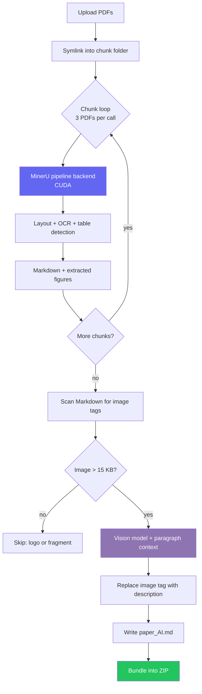

<div align="center">

<!-- TODO: replace with your logo (recommended: 120x120 SVG or PNG) -->


# PaperForge

**Turn a folder of research papers into clean, LLM-ready Markdown — figures described, tables intact, GPU-accelerated.**

<!-- TODO: replace OWNER/REPO in every badge below -->

[](https://github.com/OWNER/REPO/stargazers)
[](https://github.com/OWNER/REPO/network/members)
[](LICENSE)
[](https://colab.research.google.com/github/OWNER/REPO/blob/main/PaperForge.ipynb)

[](https://www.python.org/)
[](https://github.com/opendatalab/MinerU)
[](https://ai.google.dev/)
[](https://developer.nvidia.com/cuda-toolkit)
[](https://github.com/OWNER/REPO/issues)
[](https://github.com/OWNER/REPO/commits)
[](https://github.com/OWNER/REPO)
[](CONTRIBUTING.md)

<!-- TODO: replace with a real demo GIF (upload 21 PDFs → download markdown zip) -->


</div>

---

## Table of Contents

- [About](#about)
- [Why This Project](#why-this-project)
- [Features](#features)
- [Demo](#demo)
- [Screenshots](#screenshots)
- [Architecture](#architecture)
- [Folder Structure](#folder-structure)
- [Installation](#installation)
- [Quick Start](#quick-start)
- [Usage](#usage)
- [Configuration](#configuration)
- [API Configuration](#api-configuration)
- [Examples](#examples)
- [Performance](#performance)
- [Supported File Types](#supported-file-types)
- [Technologies Used](#technologies-used)
- [Dependencies](#dependencies)
- [FAQ](#faq)
- [Known Limitations](#known-limitations)
- [Troubleshooting](#troubleshooting)
- [Security & Privacy](#security--privacy)
- [Roadmap](#roadmap)
- [Contributing](#contributing)
- [License](#license)
- [Credits](#credits)
- [Acknowledgements](#acknowledgements)
- [Contact](#contact)
- [Support](#support)

---

## About

**PaperForge** is a Google Colab notebook that converts batches of scientific PDFs into structured Markdown suitable for RAG pipelines, LLM fine-tuning corpora, literature reviews, and note systems like Obsidian.

It runs a two-stage pipeline:

1. **Layout extraction** — [MinerU](https://github.com/opendatalab/MinerU) parses each PDF on a CUDA GPU, preserving heading hierarchy, tables, and reading order, and exporting figures as image files.
2. **Figure captioning** — every extracted figure is sent to a vision model with its surrounding paragraph as context. The image reference in the Markdown is replaced by a precise textual description of the chart, diagram, or micrograph.

The result is Markdown a language model can actually read end to end — no dangling `` placeholders where the important data lived.

> [!NOTE]
> PaperForge is a **notebook, not a library**. It is designed to be opened in Colab, run top to bottom, and produce a downloadable ZIP. There is no `pip install`.

---

## Why This Project

Most PDF-to-text tools fail research papers in one of three ways:

| Problem | Typical tool behaviour | PaperForge |
|---|---|---|
| Two-column layouts | Text interleaves across columns into nonsense | Layout model restores correct reading order |
| Tables | Flattened into unaligned text, or dropped | Preserved as Markdown tables |
| Figures | Emitted as `` — invisible to an LLM | Replaced with a written description of the content |
| Batch runs | One malformed PDF kills the whole job | Chunked execution; failures are isolated per chunk |

The figure handling is the part that matters most for RAG. A paper's key finding is frequently *in the chart*. Text-only extraction silently discards it, and your retrieval index never knows.

---

## Features

- **Batch conversion** — upload many PDFs, get one ZIP back
- **GPU-accelerated** layout analysis via MinerU's pipeline backend
- **Table preservation** — Markdown tables, not flattened text
- **Vision-model figure descriptions** with surrounding-paragraph context
- **Chunked execution** that avoids the VRAM crash affecting naive batch runs on a 16 GB GPU
- **Fully offline model loading** after a one-time download — no HuggingFace calls at conversion time
- **Automatic small-image filtering** — logos and decorative fragments are skipped, not captioned
- **Rate-limit aware** captioning with exponential backoff on HTTP 429
- **Clean output** — intermediate artifacts (`layout.pdf`, `span.pdf`, middle JSON) are deleted automatically

---

## Demo

<!-- TODO: replace with real asset -->
<div align="center">

<br />
<em>Upload → convert → caption → download. One notebook, no local setup.</em>
</div>

---

## Screenshots

<!-- TODO: capture these four and drop them in assets/ -->

<table>
<tr>
<td width="50%"><br /><em>Cell 3 — multi-file upload</em></td>
<td width="50%"><br /><em>Cell 4 — chunked conversion progress</em></td>
</tr>
<tr>
<td width="50%"><br /><em>Cell 6 — figure captioning</em></td>
<td width="50%"><br /><em>Output — image tag replaced by description</em></td>
</tr>
</table>

---

## Architecture



<details>
<summary><b>Why chunked instead of one big batch?</b></summary>

<br />

MinerU's pipeline backend processes up to **three documents concurrently**. On a 15 GB Tesla T4, three workers holding layout, OCR, and table models simultaneously — with large papers in the mix — exhausts VRAM. The workers die on CUDA OOM, and their next GPU call surfaces as:

```
Found no NVIDIA driver on your system.
```

This message is a **crash artifact, not a driver problem**. The GPU is healthy; its context was destroyed by the OOM kill.

PaperForge sidesteps this by submitting `CHUNK_SIZE` documents per invocation. Empirically, 1–4 PDFs succeed reliably on a T4 and 5+ fail. The default of 3 leaves headroom for papers exceeding 60 pages.

</details>

---

## Folder Structure

```
/content/
├── pdfs_input/                  # uploaded PDFs (sanitized filenames)
├── mineru_batch_input/          # per-chunk symlinks, recreated each iteration
├── mineru_batch_output/         # MinerU raw output, purged after extraction
├── markdown_output/
│   ├── paper_name.md            # raw conversion
│   ├── paper_name_AI.md         # figure descriptions substituted
│   └── paper_name_images/       # extracted figures
├── final_output/                # AI-enhanced files only, flattened names
└── papers_final.zip             # download artifact

/root/
├── mineru.json                  # model paths, written by the download step
└── .cache/modelscope/           # cached model weights (~2 GB)
```

---

## Installation

### Prerequisites

| Requirement | Value |
|---|---|
| Platform | Google Colab (free tier sufficient) |
| Runtime | **GPU — T4 or better**, 15 GB VRAM |
| Python | 3.11 (created automatically inside an isolated venv) |
| Disk | ~4 GB (models + intermediate output) |
| Vision API key | Google AI Studio key, or an alternative provider |

> [!IMPORTANT]
> Set **Runtime → Change runtime type → Hardware accelerator → GPU** before running anything. On a CPU runtime the conversion cell fails immediately.

### Setup

1. Open the notebook in Colab via the badge above.
2. Run **Cell 1** — installs MinerU into an isolated `uv` virtual environment at `/content/mineru_env`. Isolation is deliberate: MinerU's dependency pins conflict with Colab's preinstalled packages, and installing into the system Python breaks both.
3. Run **Cell 2** — verifies the GPU is visible.
4. Run **Cell 2.5** — downloads model weights from ModelScope (~2 GB, one time per session).

<details>
<summary><b>Why ModelScope rather than HuggingFace?</b></summary>

<br />

MinerU defaults to fetching weights from HuggingFace. In many Colab and corporate network environments those requests are refused outright, producing:

```
[Errno 111] Connection refused
```

on **every** document, because all workers wait on the same failed download. ModelScope hosts identical weights and is reachable from environments where HuggingFace is not. After the download, the notebook sets `MINERU_MODEL_SOURCE=local` and enables offline mode so no network call occurs during conversion.

</details>

---

## Quick Start

```text
Runtime → Change runtime type → GPU
Run Cell 1   →  install MinerU        (~5 min, once per session)
Run Cell 2   →  verify GPU
Run Cell 2.5 →  download models       (~2 min, once per session)
Run Cell 3   →  upload your PDFs
Run Cell 4   →  convert               (~1–3 min per paper)
Run Cell 5   →  add your vision API key
Run Cell 6   →  caption figures
Run Cell 7   →  download papers_final.zip
```

---

## Usage

### Uploading

Cell 3 opens a multi-select file picker. Filenames are sanitized automatically — spaces and parentheses are replaced, since they break MinerU's output-directory matching.

### Converting

Cell 4 loops over your PDFs in chunks. Progress is reported per chunk, and results are extracted immediately after each chunk so a later failure never costs you earlier work:

```text
Converting 21 PDFs in 7 chunks of 3
  Tables: ON | Formulas: OFF | Backend: pipeline

[chunk 1/7] processing 3 PDFs...
  chunk 1 done in 3.2 min

[chunk 2/7] processing 3 PDFs...
  chunk 2 done in 2.8 min
...
============================================================
Total: 21.4 min for 21 papers  (21 ok, 0 failed)
============================================================
```

### Captioning

Cell 6 walks each Markdown file, locates image references, and replaces qualifying ones with descriptions. Images under `MIN_IMAGE_KB` are skipped. Output is written to `<paper>_AI.md`; the original is left untouched so you can diff them.

---

## Configuration

All tunables live at the top of their respective cells.

### Conversion (Cell 4)

| Variable | Default | Purpose |
|---|---|---|
| `CHUNK_SIZE` | `3` | PDFs per MinerU invocation. Lower to `1` if a chunk still OOMs; raise to `4` for marginal speed. |
| `MINERU_TABLE_ENABLE` | `true` | Table detection and Markdown conversion |
| `MINERU_FORMULA_ENABLE` | `false` | LaTeX equation parsing. Set `true` if you need equations — expect a significant slowdown. |
| `MINERU_PDF_RENDER_WORKERS` | `4` | Page-to-image render concurrency |
| `MINERU_DEVICE_MODE` | `cuda` | Set `cpu` to run without a GPU (very slow) |
| `MINERU_MODEL_SOURCE` | `local` | Load from cache; never set to `huggingface` after Cell 2.5 |
| `MINERU_VIRTUAL_VRAM_SIZE` | `8` | Per-process VRAM ceiling hint |
| `-m` (method) | `txt` | `txt` for born-digital PDFs, `ocr` for scans, `auto` to detect |
| `-l` (language) | `ch` | Multilingual OCR model; use `en` for marginally faster English-only runs |

### Captioning (Cell 6)

| Variable | Default | Purpose |
|---|---|---|
| `MIN_IMAGE_KB` | `15` | Images below this are skipped as decorative |
| `CONTEXT_CHARS` | `500` | Characters of surrounding text passed as context |
| `RATE_LIMIT_DELAY` | `4.5` | Seconds between API calls. See the note below. |
| `MAX_PARALLEL` | `1` | Concurrent requests; keep at 1 while rate-limited |

> [!TIP]
> `RATE_LIMIT_DELAY = 4.5` yields roughly 13 requests/minute. Gemini Flash-class models permit substantially more on the free tier — lowering this to `1.1` (≈54/min) cuts captioning time by about 4× at no cost. Verify your model's current limit before changing it.

---

## API Configuration

The notebook reads your key from Colab Secrets, falling back to an input prompt:

```python
from google.colab import userdata
API_KEY = userdata.get('GEMINI_API_KEY')
```

To store it: **🔑 (left sidebar) → Add new secret → Name `GEMINI_API_KEY` → paste value → enable Notebook access**.

> [!WARNING]
> Never hardcode the key in a cell. Colab notebooks saved to GitHub retain cell contents, and committed keys are scraped within minutes.

Obtain a key at [Google AI Studio](https://aistudio.google.com/apikey).

---

## Examples

**Before** — raw MinerU output:

```markdown
## 3.2 Capacity Fade Analysis


As shown in Figure 4, the degradation trend...
```

**After** — figure description substituted:

```markdown
## 3.2 Capacity Fade Analysis

Line chart plotting discharge capacity retention (%) against cycle number
across 1,000 cycles for four C-rates. All cells retain above 90% capacity
through cycle 400. The 2C curve diverges sharply after cycle 600, ending
near 71%, while 0.5C retains 88%. Demonstrates that elevated C-rate
accelerates capacity fade primarily in the later cycling regime.

As shown in Figure 4, the degradation trend...
```

The retrieval index now contains the chart's actual finding, not an opaque filename.

---

## Performance

Measured on Colab free tier, Tesla T4 (15 GB), typical journal articles of 8–20 pages.

| Stage | Throughput | Notes |
|---|---|---|
| Environment install (Cell 1) | ~5 min | Once per session |
| Model download (Cell 2.5) | ~2 min | Once per session, ~2 GB |
| Conversion | **~1–3 min per paper** | Varies with page count and figure density |
| Captioning @ 4.5 s delay | ~13 figures/min | Default, conservative |
| Captioning @ 1.1 s delay | ~54 figures/min | Recommended after verifying limits |

<!-- TODO: fill in from your own runs -->
- Largest verified batch: `<TODO>` PDFs
- Largest verified single document: `<TODO>` pages
- Observed table fidelity: `<TODO>`

> [!NOTE]
> Chunking reloads the model once per chunk rather than once per session. This costs roughly one minute per chunk in overhead — a deliberate trade for not crashing partway through a long run.

---

## Supported File Types

| Type | Status | Notes |
|---|---|---|
| PDF (born-digital) | ✅ Primary | Use `-m txt` |
| PDF (scanned) | ⚠️ Supported | Switch to `-m ocr` or `-m auto`; slower |
| DOCX / PPTX / XLSX | ⚠️ Untested | MinerU's CLI accepts them; this notebook has not been validated on them |
| Images (PNG/JPG) | ⚠️ Untested | Accepted by MinerU |
| Encrypted / password PDFs | ❌ Unsupported | Decrypt before uploading |

---

## Technologies Used

| Layer | Technology |
|---|---|
| Layout extraction | MinerU 3.4.4 (pipeline backend) |
| Deep learning | PyTorch + CUDA |
| Models | PDF-Extract-Kit-1.0 — layout, OCR, table recognition |
| Model hosting | ModelScope |
| Figure captioning | Google Gemini (vision) |
| Environment isolation | `uv` virtual environment, Python 3.11 |
| Runtime | Google Colab |
| Image handling | Pillow |
| Concurrency | `asyncio` with semaphore-based rate limiting |

---

## Dependencies

Installed automatically — listed for transparency.

<details>
<summary><b>Expand dependency list</b></summary>

<br />

**Inside `/content/mineru_env` (isolated):**
- `mineru[core]==3.4.4`
- `torch`, `torchvision` (CUDA build)
- `accelerate`, `transformers`
- `click`, `httpx`, `fastapi`, `uvicorn`

**Colab system Python:**
- `google-generativeai` *(deprecated upstream — see Roadmap)*
- `pillow`

The two environments are intentionally separate. MinerU's pins conflict with Colab's preinstalled stack; isolating them prevents both from breaking.

</details>

---

## FAQ

<details>
<summary><b>Do I need a paid Colab subscription?</b></summary>
<br />
No. The free tier's T4 is sufficient. Pro raises session limits and reduces GPU queueing, which helps for large batches.
</details>

<details>
<summary><b>Can I run this locally?</b></summary>
<br />
The pipeline itself is portable, but the notebook uses Colab-specific APIs (<code>google.colab.files</code>, <code>userdata</code>) for upload, download, and secrets. Running locally requires replacing those three touchpoints. A CLI runner is on the roadmap.
</details>

<details>
<summary><b>Why are equations disabled by default?</b></summary>
<br />
Formula parsing is the single largest contributor to conversion time. Most retrieval use cases don't need LaTeX. Set <code>MINERU_FORMULA_ENABLE=true</code> if yours does.
</details>

<details>
<summary><b>Why does it use Chinese OCR (<code>-l ch</code>) for English papers?</b></summary>
<br />
Despite the name, <code>ch</code> is MinerU's multilingual model and handles English well. Switching to <code>en</code> is marginally faster for English-only corpora.
</details>

<details>
<summary><b>Are my PDFs uploaded anywhere?</b></summary>
<br />
PDFs stay on your Colab VM. Only <em>extracted figure images</em> are sent to the vision API. See <a href="#security--privacy">Security & Privacy</a>.
</details>

<details>
<summary><b>Can I swap in a different vision model?</b></summary>
<br />
Yes. The captioning stage is isolated in one function. Any vision-capable API works — see the Roadmap for planned first-class alternatives.
</details>

---

## Known Limitations

> [!WARNING]
> Read this section before running large batches. Most reported failures are environmental, not bugs.

### Vision API quotas

Free-tier vision APIs impose per-minute and per-day request caps. A batch of 21 papers can easily contain 300+ figures. Two distinct failures look similar but are not:

| Error text | Meaning | Fix |
|---|---|---|
| `429 ... rate limit` | Requests too fast | Raise `RATE_LIMIT_DELAY` |
| `429 ... prepayment credits are depleted` | **Quota/billing exhausted** | New project key, or add billing |

The second is not solvable by slowing down. The notebook retries with backoff on rate limits; it cannot retry past an empty quota.

### Colab session constraints

| Constraint | Free tier |
|---|---|
| Idle timeout | ~90 minutes |
| Maximum session | ~12 hours |
| Disconnect behaviour | **Filesystem wiped** — models and outputs lost |
| GPU availability | Not guaranteed at peak times |

Cells 1 and 2.5 must be re-run after every disconnect. Download your ZIP before stepping away.

### GPU memory

The 15 GB T4 cannot hold three concurrent MinerU workers on large documents. This is the origin of the misleading `Found no NVIDIA driver` error. Chunking mitigates it; very large documents (100+ pages) may still require `CHUNK_SIZE = 1`.

### Other limitations

- **Colab file uploads** become unreliable above a few hundred MB — split large batches
- **Scanned PDFs** require OCR mode and run considerably slower
- **Multi-column figure captions** occasionally attach to the wrong figure
- **Very wide tables** may lose column alignment in Markdown
- **`google.generativeai` is deprecated upstream** — a warning is printed; migration is on the roadmap
- **No resume capability** — an interrupted run restarts from the beginning

---

## Troubleshooting

<details>
<summary><b><code>[Errno 111] Connection refused</code> on every document</b></summary>

<br />

Models are being fetched at runtime and the request is refused. Confirm Cell 2.5 ran successfully and that Cell 4 contains `MINERU_MODEL_SOURCE = 'local'` — not `'huggingface'`. Verify:

```python
print(env.get('MINERU_MODEL_SOURCE'))          # expect: local
print(Path('/root/mineru.json').exists())       # expect: True
```

After a runtime restart the cache is gone; re-run Cell 2.5.

</details>

<details>
<summary><b><code>Found no NVIDIA driver on your system</code> (but <code>nvidia-smi</code> works)</b></summary>

<br />

This is a **CUDA OOM crash artifact**, not a driver fault. A worker was killed for exhausting VRAM; its next GPU call reports the destroyed context this way.

Reduce `CHUNK_SIZE` to `1` and re-run. Also confirm no stale server is holding VRAM:

```python
!pkill -f mineru-api
!nvidia-smi
```

</details>

<details>
<summary><b>Conversion hangs indefinitely with no output</b></summary>

<br />

Usually a leftover `mineru-api` process blocked on a full stdout pipe. Kill it and restart the runtime:

```python
!pkill -f mineru-api
```

Avoid running a persistent `mineru-api` server with `stdout=subprocess.PIPE` and nothing draining it — the OS pipe buffer fills at ~64 KB and the server deadlocks on its own logging.

</details>

<details>
<summary><b><code>Invalid value for '-b' / '--backend'</code></b></summary>

<br />

Backend names changed across MinerU versions. Valid values in 3.4.4:

```
pipeline, vlm-engine, hybrid-engine, vlm-http-client, hybrid-http-client
```

Use `pipeline`. Check yours with `!/content/mineru_env/bin/mineru --help`.

</details>

<details>
<summary><b>Model download aborts immediately</b></summary>

<br />

`mineru-models-download` prompts interactively for a model type. A subprocess with no stdin aborts. Supply the answer:

```python
subprocess.run([...], input='pipeline\n', capture_output=True, text=True)
```

</details>

<details>
<summary><b><code>✗ No output folder</code> for every paper</b></summary>

<br />

MinerU exited before writing anything. The summary truncates stderr — print it in full:

```python
print(proc.stderr)
```

The root cause is near the top of the traceback, not the last line.

</details>

---

## Security & Privacy

| Concern | Handling |
|---|---|
| PDF contents | Remain on your Colab VM; never uploaded to third parties |
| Figure images | **Sent to the vision API** for captioning |
| Extracted text | Never transmitted — only the ±500-character context around each figure |
| API key | Read from Colab Secrets; never written to disk or output |
| Persistence | Colab VM storage is ephemeral and wiped on disconnect |

> [!CAUTION]
> Do not process confidential or embargoed documents without reviewing your vision provider's data-retention policy. Figure images leave your machine.

---

## Roadmap

- [ ] Migrate `google.generativeai` → `google.genai` (upstream deprecation)
- [ ] Alternative vision backends — Qwen-VL, Claude, local VLM
- [ ] Resume capability for interrupted batches
- [ ] Standalone CLI runner for non-Colab environments
- [ ] Per-document progress bar and time estimates
- [ ] Automatic `CHUNK_SIZE` tuning from detected VRAM
- [ ] Optional equation preservation preset
- [ ] Batch cost estimator before captioning
- [ ] Direct export to Obsidian and Zotero
- [ ] Regression test suite over a fixed PDF corpus

---

## Contributing

Contributions are welcome — especially failure reports with reproducible PDFs.

1. Fork the repository
2. Create a branch (`git checkout -b feat/your-feature`)
3. Test the full notebook top to bottom on a fresh Colab runtime
4. Commit (`git commit -m 'feat: add your feature'`)
5. Open a pull request describing what you changed and how you verified it

**Guidelines**

- Notebook cells stay independently runnable and clearly numbered
- Configuration goes at the top of a cell, never buried mid-logic
- Non-obvious workarounds require a comment explaining *why*
- New environment variables must be documented in [Configuration](#configuration)
- Python follows PEP 8

<!-- TODO: create CONTRIBUTING.md and CODE_OF_CONDUCT.md, or remove these links -->
See [CONTRIBUTING.md](CONTRIBUTING.md) and [CODE_OF_CONDUCT.md](CODE_OF_CONDUCT.md).

---

## License

<!-- TODO: choose a license and add the LICENSE file -->
Released under the `<TODO: MIT / Apache-2.0 / GPL-3.0>` License. See [LICENSE](LICENSE).

> [!NOTE]
> MinerU and the models it downloads carry their own licenses. Review them before commercial use.

---

## Credits

| Project | Role |
|---|---|
| [MinerU](https://github.com/opendatalab/MinerU) — OpenDataLab | PDF layout extraction |
| [PDF-Extract-Kit](https://github.com/opendatalab/PDF-Extract-Kit) | Layout, OCR, and table models |
| [ModelScope](https://modelscope.cn/) | Model weight hosting |
| [Google Gemini](https://ai.google.dev/) | Vision captioning |
| [uv](https://github.com/astral-sh/uv) — Astral | Environment isolation |
| [Google Colab](https://colab.research.google.com/) | Free GPU runtime |

---

## Acknowledgements

Built while assembling a corpus of battery-research literature for retrieval-augmented generation. The chunked-execution workaround came out of a long debugging session against a VRAM ceiling that reported itself as a missing GPU driver — documented here so nobody else loses an afternoon to it.

Thanks to the OpenDataLab team for MinerU, and to everyone who files detailed issues.

---

## Contact

<!-- TODO: fill in your links -->

[](https://github.com/YOURHANDLE)
[](https://linkedin.com/in/YOURPROFILE)
[](mailto:you@example.com)

---

## Support

If PaperForge saved you time:

⭐ **Star the repository** — it's the single most useful signal
🐛 **Report bugs** with the failing PDF and full stderr
💡 **Request features** via [Issues](https://github.com/OWNER/REPO/issues)
🔀 **Open a pull request**

### Star History

<!-- TODO: replace OWNER/REPO -->
[](https://star-history.com/#OWNER/REPO&Date)

<div align="center">

<!-- TODO: replace YOURHANDLE -->


<br /><br />

**Built for researchers who'd rather read papers than parse them.**

<sub>If this helped, a ⭐ goes a long way.</sub>

</div>
